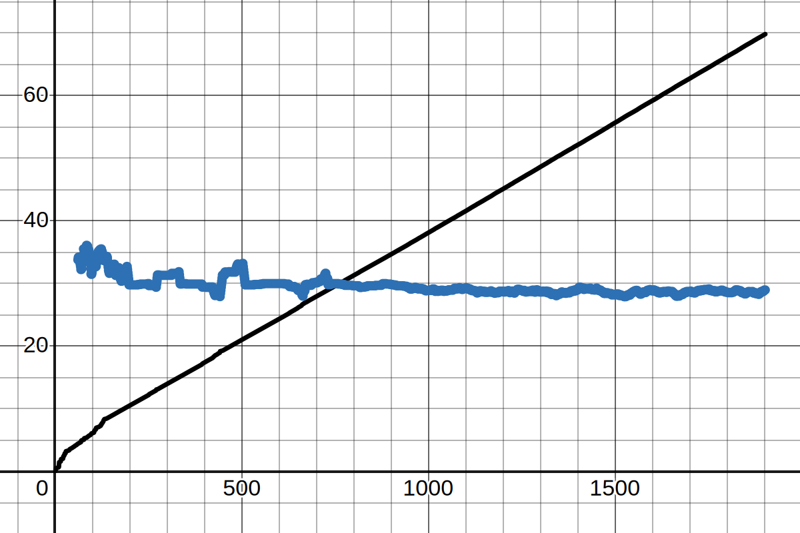
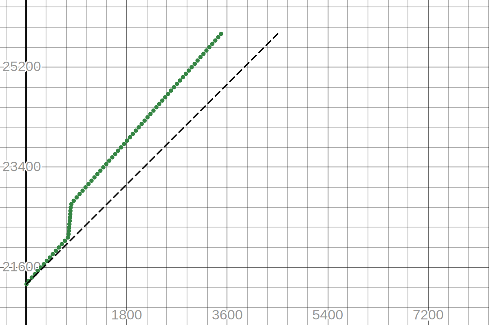
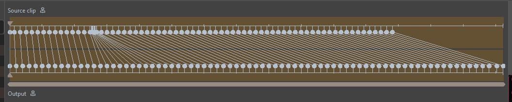

# **Introduction**

20/Oct/2025, 21/Oct/2025

[My friend](https://github.com/HyperPlexG) sent me a MP4 screen recording of a
workshop held in Google Meet, which was corrupted.

The MP4 format stores very critically important information at the END of the
video file. So if your screen recording software (or whatever) crashes before
fully saving the file, you're cooked.

This repo documents my experience in attempting to recover this MP4 file.

---

# 👉 **Part 1: `recover_mp4.exe`**

I asked him to record a dummy video with the **same** video recorder (Game Bar),
and I used [recover_mp4.exe](https://slydiman.me/eng/mmedia/recover_mp4.htm)
to patch the original corrupted file. Let's call this dummy video "**donor**",
since it's donating us its MP4 headers :)

## Commands

Commands were provided by the `recover_mp4.exe` program itself.

```batch
recover_mp4.exe donor.mp4 --analyze

recover_mp4.exe input.mp4 output.h264 output.aac --ext

ffmpeg.exe -r 30.000 -i output.h264 -i output.aac -bsf:a aac_adtstoasc -c:v copy -c:a copy output.mp4
```

I also remuxed `output.h264` to `output.h264.ts` using FFmpeg, for stability.

## Analysis

This gave me valid audio and video files. But, the video was messed up, in the
sense that some portions were severely fast forwarded, some were normal, etc.
The whole video felt slightly faster too, and was non-linearly out of sync with
the audio.

I tried to extract the [PTS values](donor%20pts.txt) from the **donor** file,
to gain some insight about the characteristics of the screen recorder.

```batch
ffmpeg -i donor.mp4 -vf setpts=print(PTS) -f null - > donor_pts.txt
```

> [!TIP]
> **PTS** = Presentation TimeStamp = basically the timestamp when every single
> frame is displayed.
> For example, in a 10 FPS video, the PTS values would be $0.00$, $0.10$,
> $0.20$, $0.30$, $0.40$, ...<br/>
> PTS is usually stored as a multiple of some "base". In this case, "30000" is
> the base, such that 30000 units equal 1 second of video. So for example, in a
> 10 FPS video, the PTS values would be $0$, $3000$, $6000$, $9000$, $12000$, ...

Here's the graph:
- Black line = frame timings
- Blue line = frame rate (moving average of last 60 PTS values)
- ↔️ X axis = Frame number. 1 unit = 1 frame
- ↕️ Y axis (black line) = Timestamp. 1 unit = 1 second
- ↕️ Y axis (blue line) = Frame rate. 1 unit = 1 FPS
- 📈 https://www.desmos.com/calculator/j1dswlh5ji



As you can see from the graph, the frame timings are NOT linear. You can also
see how the Moving average frame rate fluctuates a lot. This confirms that the
video was recorded using a [**Variable Frame Rate (VFR)**](https://en.wikipedia.org/wiki/Variable_frame_rate),
i.e. the FPS in the original recording would be variable.

---

# 👉 **Part 2: Estimate PTS**

The goal is to now somehow **estimate** the original PTS values prior to
corruption, which is impossible. So what I'm gonna do is, I can use the
"Google Meet clock" at the corner as a reference for the "actual supposed time".
Better something than nothing!


I created a [Python script](extract_gmeet_timestamp.py) which keeps looking at
the clock time from the video. Whenever the clock time changes, it saves a
snapshot of that moment to a file, in the [gmeet_timestamps/](gmeet_timestamps/README.md)
folder. Each file is named with the exact timestamp of the video when that clock
image was found. Check out the folder for a README :)

# Analysis

1. Analyzing the script's output:

    Here's the graph:
    - ↔️ X axis: video timestamp. 1 unit = 1 second
    - ↕️ Y axis: clock time. 1 unit = 1 second, e.g. 5:55 PM $= 5×3600 + 55×60 = 21300$
    - 📈 https://www.desmos.com/calculator/k6mdtmq7tr
    - Green dots = Samples of clock time versus the video timestamp
    - Black line = "expected" speed of the video

    

    We can basically notice that from 12:24 to 13:27 of the video, the timings
    have been messed up. Here, 10 minutes of real time has been covered in just
    1 minute. This was the silent portion where the <b>person had left the
    meeting due to poor internet</b>.

    We can also notice how it is NOT parallel to the black line, which confirms
    the suspicion from earlier that the video is sped-up.

    This is useful data! This effectively tell me "what timestamp of this
    sped-up video is supposed to be occuring at what clock time"! This data is
    available in the [gmeet_timestamps.csv](gmeet_timestamps.csv) file.

2. Analyzing the recovered audio:

    It can be noted that the audio is stereo, but the human voices are still in
    mono. This is a benefit, since the Google Meet's "join" sound effect is
    stereo.

    I tried to simply invert a channel and mixing with the other, and it turns
    out that it will extract the Google Meet's "join" sound effects, since that
    sound effect is in stereo. This can be used to visually align with the
    video. [Audacity](https://www.audacityteam.org/) is the best tool for this.

    This didn't really help much, though. Fun, regardless!

---

# 👉 **Part 3: Apply PTS values!**

[Kdenlive](https://kdenlive.org/) has a [Time Remapping](https://docs.kdenlive.org/en/effects_and_filters.html#time-remapping)
feature. I can use the data obtained in the previous section for time-remapping,
and obtain something like this:


This effectively stretches that sped-up portion to be of "normal" speed!

I had to do some minor audio stretching too, since it seems that the silent
portion's audio has been completely discarded, not silenced.

The end result? A decent-but-accurate video, with slightly out-of-sync audio.
Which is quite respectable!

---

# 👉 **Conclusion**

So... what did we learn from this?

1. Just don't use MP4 ffs. Use MKV to record!!! MKV files are still recoverable
   even if the recording software crashes, it's resilient to this shit.

2. Time remapping is really cool!
